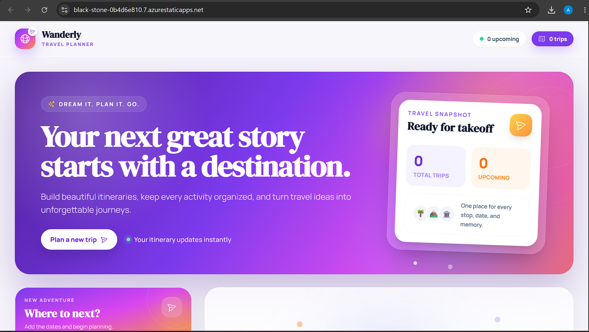
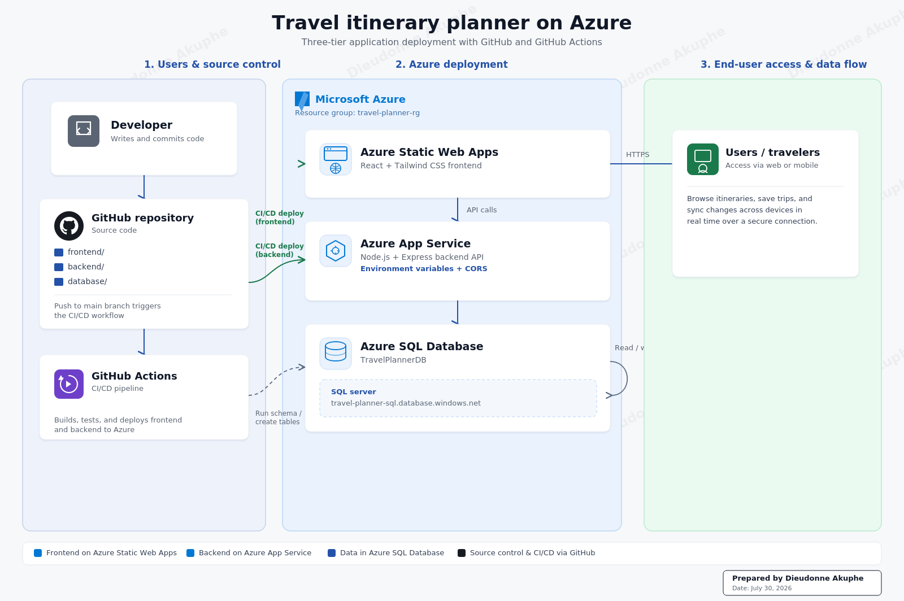
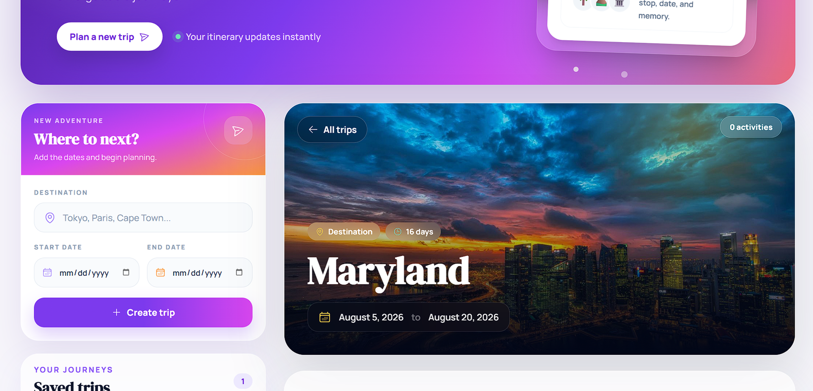
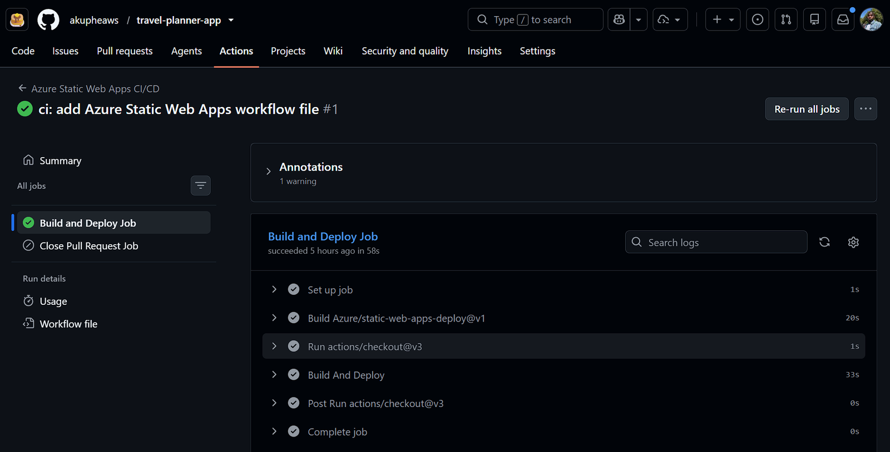
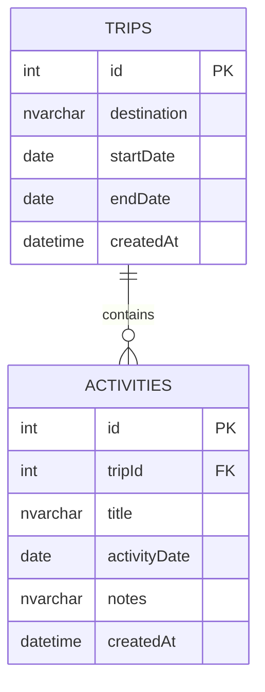

<div align="center">

# A Three Tier Travel Itinerary Planner on Microsoft Azure

## Azure Travel Itinerary Planner

A production inspired three tier cloud application for creating trips, organizing activities, and managing travel itineraries through a responsive web experience.

[](https://azure.microsoft.com/)
[](https://react.dev/)
[](https://nodejs.org/)
[](https://azure.microsoft.com/products/azure-sql/database)
[](https://github.com/features/actions)

[View Live Application](https://black-stone-0b4d6e810.7.azurestaticapps.net/) · [API Health Endpoint](https://travel-planner-rg-api-acbdfzfahhahaja7.centralus-01.azurewebsites.net/health) · [Repository](https://github.com/akupheaws/travel-planner-app)

**Designed and deployed by Dieudonne Akuphe**

</div>

---

## Executive Summary

Wanderly is a full stack travel planning platform designed to demonstrate how a modern web application can be structured, deployed, secured, and automated on Microsoft Azure.

The solution separates the presentation, application, and data responsibilities into independent cloud services. The React frontend is delivered through Azure Static Web Apps. The Node.js and Express REST API runs on Azure App Service. Trip and activity records are stored in Azure SQL Database. GitHub Actions provides automated deployment workflows for both application layers.

This project demonstrates practical experience in cloud architecture, application integration, API development, relational data modeling, configuration management, CI/CD automation, deployment troubleshooting, and secure communication between distributed services.

> **Recruiter snapshot:** Azure PaaS architecture, React, Node.js, Express, REST APIs, Azure SQL, GitHub Actions, CORS, environment variables, parameterized queries, relational constraints, responsive design, and cloud deployment validation.

---

## Project at a Glance

| Engineering Area | Implementation |
|---|---|
| Architecture | Three tier cloud architecture |
| Frontend | React 18, Vite, Tailwind CSS, Axios |
| Backend | Node.js, Express, REST API |
| Database | Azure SQL Database, SQL Server schema |
| Frontend Hosting | Azure Static Web Apps |
| Backend Hosting | Azure App Service |
| Delivery Automation | Two GitHub Actions workflows |
| Data Model | Trips and Activities with relational integrity |
| API Surface | Six domain operations and one health endpoint |
| Security Controls | CORS, environment based secrets, TLS, parameterized SQL |

---

## Business Challenge

Travelers often manage destinations, dates, activities, and notes across several disconnected tools. This makes itinerary planning difficult to organize and creates unnecessary friction when plans change.

Wanderly addresses this challenge through a centralized application where users can create trips, organize activities by date, review saved journeys, and remove outdated plans from a single interface.

The technical goal was broader than building a user interface. The project was designed to show how a business requirement can be translated into a maintainable cloud solution with clear service boundaries, secure configuration, persistent storage, automated delivery, and room for future growth.

---

## Live Product Experience



The interface includes a responsive travel dashboard, trip creation workflow, live trip counters, destination cards, activity management, loading feedback, toast notifications, and a mobile friendly layout.

---

## Solution Architecture



### Architecture Flow

1. A developer commits application changes to the GitHub repository.

2. GitHub Actions detects changes to the frontend or backend directories.

3. The frontend workflow builds the React application and deploys the generated `dist` output to Azure Static Web Apps.

4. The backend workflow installs Node.js dependencies and deploys the Express API to Azure App Service.

5. Users access the frontend over HTTPS through the Azure Static Web Apps endpoint.

6. The frontend sends API requests to Azure App Service using the environment specific `VITE_API_URL` value.

7. Azure App Service validates requests and performs database operations through a managed SQL connection pool.

8. Azure SQL Database stores trip and activity data while enforcing relational and date integrity rules.

---

## Engineering Decisions

| Decision | Implementation | Engineering Value |
|---|---|---|
| Independent application layers | Frontend, backend, and database are deployed separately | Each layer can be maintained and scaled independently |
| Managed Azure services | Static Web Apps, App Service, and Azure SQL Database | Reduces server administration and supports repeatable deployment |
| Environment based configuration | API URLs, database credentials, ports, and allowed origins are externalized | Keeps configuration separate from source code |
| Parameterized SQL queries | All database inputs use typed parameters through the `mssql` package | Reduces SQL injection risk and improves query consistency |
| Startup dependency validation | The API connects to the database before accepting traffic | Prevents the service from reporting healthy while the data layer is unavailable |
| Relational data controls | Foreign keys, cascading deletes, indexes, and date constraints | Protects data quality and improves query performance |
| Path filtered workflows | Frontend and backend pipelines run only when their files change | Reduces unnecessary workflow executions |
| Deployment concurrency controls | Older workflow runs are cancelled when newer commits arrive | Prevents stale deployments from overwriting current changes |

---

## Core Application Capabilities

1. Create a trip using a destination, start date, and end date.

2. View all saved trips ordered by creation time.

3. Select a trip and load its associated activities.

4. Add activities with a title, date, and optional notes.

5. Delete individual activities.

6. Delete a trip and its related activities.

7. Display trip duration and upcoming trip counts.

8. Present loading, success, empty, and error states through the frontend.

9. Normalize backend and network errors through the Axios client.

10. Validate required fields and date relationships in both the application and database layers.

---

## Product Screenshots

### Trip Creation and Saved Journey Experience



### Automated Frontend Deployment



The deployment evidence above shows a successful Azure Static Web Apps workflow run from the project repository. The workflow checks out the source, builds the React application, publishes the generated output, and reports the deployment result through GitHub Actions.

---

## CI/CD Implementation

The repository contains separate delivery pipelines for the frontend and backend. This allows each service to be deployed independently while remaining part of the same application repository.

### Frontend Pipeline

The Azure Static Web Apps workflow:

1. Runs when frontend files or the workflow file change.

2. Supports pushes to `main`, pull request validation, and manual execution.

3. Verifies that the Static Web Apps deployment token is available.

4. Builds the application from `./frontend`.

5. Publishes the Vite output from `dist`.

6. Creates temporary pull request environments and removes them when a pull request closes.

7. Cancels older in progress runs when a newer commit is available.

### Backend Pipeline

The Azure App Service workflow:

1. Runs when backend files or the workflow file change.

2. Uses Node.js 24 in the deployment runner.

3. Validates that `backend/package.json` exists before installing dependencies.

4. Uses `npm ci` when a lock file is present.

5. Verifies that the App Service publish profile secret exists.

6. Deploys the backend package to the production slot of `travel-planner-rg-api`.

7. Applies concurrency controls so only the newest production deployment continues.

---

## Security and Reliability Controls

### Application Security

1. The backend uses the `ALLOWED_ORIGIN` environment variable to restrict browser requests to the deployed frontend domain.

2. Database credentials are loaded from environment variables rather than embedded in application code.

3. Azure SQL communication uses encryption with certificate validation enabled in production.

4. Database queries use typed parameters instead of dynamic string concatenation.

5. The API validates identifiers, required fields, and trip date order before executing database operations.

### Data Integrity

1. The `Trips` table requires a destination, start date, and end date.

2. A database check constraint prevents an end date from occurring before a start date.

3. The `Activities` table references `Trips` through a foreign key.

4. Cascading delete behavior removes dependent activities when a trip is deleted.

5. Indexes support trip ordering and activity lookup by trip identifier.

### Operational Reliability

1. A reusable SQL connection pool limits connection overhead.

2. The API does not begin accepting requests until the database connection succeeds.

3. A dedicated `/health` endpoint provides a simple service availability check.

4. Global error handling returns consistent JSON responses for unexpected failures.

5. CI/CD secret validation causes workflows to fail early with a clear message when required credentials are missing.

---

## REST API

### Health

| Method | Endpoint | Purpose |
|---|---|---|
| `GET` | `/health` | Returns API status and timestamp |

### Trips

| Method | Endpoint | Purpose |
|---|---|---|
| `GET` | `/trips` | Retrieve all trips |
| `POST` | `/trips` | Create a new trip |
| `DELETE` | `/trips/:id` | Delete a trip and its activities |

### Activities

| Method | Endpoint | Purpose |
|---|---|---|
| `GET` | `/trips/:tripId/activities` | Retrieve activities for a trip |
| `POST` | `/trips/:tripId/activities` | Add an activity to a trip |
| `DELETE` | `/activities/:id` | Delete an activity |

### Example Trip Request

```json
{
  "destination": "Tokyo, Japan",
  "startDate": "2026-08-05",
  "endDate": "2026-08-20"
}
```

### Example Activity Request

```json
{
  "title": "Visit Sensoji Temple",
  "activityDate": "2026-08-07",
  "notes": "Arrive early and reserve time for the surrounding market."
}
```

---

## Data Model



The schema script is idempotent, which means it can be executed multiple times without recreating existing tables or indexes.

---

## Repository Structure

```text
travel-planner-app/
├── .github/
│   └── workflows/
│       ├── azure-static-web-apps-black-wave-0e203db10.yml
│       └── main_travel-planner-rg-api.yml
├── backend/
│   ├── config/
│   │   └── db.js
│   ├── controllers/
│   │   ├── activityController.js
│   │   └── tripController.js
│   ├── database/
│   │   └── schema.sql
│   ├── routes/
│   │   ├── activityRoutes.js
│   │   └── tripRoutes.js
│   ├── app.js
│   ├── server.js
│   └── package.json
├── frontend/
│   ├── src/
│   │   ├── api/
│   │   │   └── api.js
│   │   ├── components/
│   │   ├── App.jsx
│   │   ├── index.css
│   │   └── main.jsx
│   ├── index.html
│   ├── tailwind.config.js
│   ├── vite.config.js
│   └── package.json
├── docs/
│   └── images/
└── README.md
```

---

## Run the Project Locally

### Prerequisites

1. Node.js 18 or later

2. npm

3. Microsoft SQL Server or Azure SQL Database

4. Git

### Clone the Repository

```bash
git clone https://github.com/akupheaws/travel-planner-app.git
cd travel-planner-app
```

### Configure the Database

Create `TravelPlannerDB`, then execute:

```text
backend/database/schema.sql
```

The script creates the `Trips` and `Activities` tables, foreign key relationship, constraints, and indexes.

### Start the Backend

```bash
cd backend
npm install
cp .env.example .env
npm run dev
```

Example backend environment configuration:

```env
DB_SERVER=your-server.database.windows.net
DB_USER=your-database-user
DB_PASSWORD=your-database-password
DB_NAME=TravelPlannerDB
DB_PORT=1433
PORT=5000
NODE_ENV=development
ALLOWED_ORIGIN=http://localhost:3000
```

### Start the Frontend

Open a second terminal:

```bash
cd frontend
npm install
npm run dev
```

Frontend environment configuration:

```env
VITE_API_URL=http://localhost:5000
```

Open the local Vite address displayed in the terminal.

> Never commit real database passwords, deployment tokens, publish profiles, or production environment files to source control.

---

## Azure Deployment Configuration

### Backend App Service Settings

```env
DB_SERVER=travel-planner-sql.database.windows.net
DB_USER=your-database-user
DB_PASSWORD=your-database-password
DB_NAME=TravelPlannerDB
DB_PORT=1433
NODE_ENV=production
ALLOWED_ORIGIN=https://black-stone-0b4d6e810.7.azurestaticapps.net
```

### Frontend Build Setting

```env
VITE_API_URL=https://travel-planner-rg-api-acbdfzfahhahaja7.centralus-01.azurewebsites.net
```

Because Vite injects frontend environment variables during the build, any change to `VITE_API_URL` requires a new frontend deployment.

---

## Engineering Challenges Solved

### Monorepo Deployment Paths

Azure deployment initially searched the repository root for application files. The workflows were corrected to use `./frontend` for the static application and `backend` for the API package.

### Environment Specific API Connectivity

The frontend and backend use different domains in Azure. The solution externalizes the API base URL and CORS origin so local development and cloud deployment can use separate values without changing application logic.

### Azure SQL Connectivity

The backend requires valid credentials, Azure SQL firewall access, TLS configuration, and the correct logical server name. Startup connection validation and App Service environment variables make failures visible and prevent the API from starting in a partially available state.

### CI/CD Runtime Compatibility

The backend workflow was updated to use a supported Node.js runtime and deterministic dependency installation. Workflow checks also verify required files and secrets before deployment begins.

### Data Consistency During Deletion

Trip deletion removes related activities at both the application and database levels. This protects referential integrity even when one enforcement layer changes in the future.

---

## Future Enhancements

1. Add Microsoft Entra ID or another identity provider for user authentication.

2. Add role based authorization and user specific itineraries.

3. Move application secrets into Azure Key Vault.

4. Add Application Insights, Azure Monitor alerts, and structured logging.

5. Add automated unit, API, and browser tests to the delivery pipelines.

6. Provision the complete environment through Terraform or Bicep.

7. Add private endpoints for Azure SQL and restrict public network access.

8. Add update operations, itinerary sharing, notifications, and collaborative planning.

9. Add backup validation, disaster recovery documentation, and regional resilience testing.

10. Introduce deployment slots for controlled backend releases and rollback.

---

## Project Outcome

Wanderly demonstrates the complete delivery of a cloud hosted application from business requirement to working Azure deployment. The project combines a polished user experience with a structured backend API, a relational data model, managed cloud services, secure configuration, and automated delivery workflows.

The strongest outcome is not only that the application runs in the cloud. It is that each component has a clear responsibility, each deployment path is repeatable, each data operation is controlled, and the overall system provides a practical foundation for security, monitoring, scalability, resilience, and future product development.

This project reflects hands on capability across cloud engineering, DevOps, backend development, frontend integration, database design, and technical troubleshooting within a single end to end solution.

---

<div align="center">

### Prepared by Dieudonne Akuphe

Cloud and DevOps Engineer focused on scalable platforms, resilient systems, automation, and intelligent cloud solutions.

[Live Application](https://black-stone-0b4d6e810.7.azurestaticapps.net/) · [GitHub Repository](https://github.com/akupheaws/travel-planner-app)

</div>
